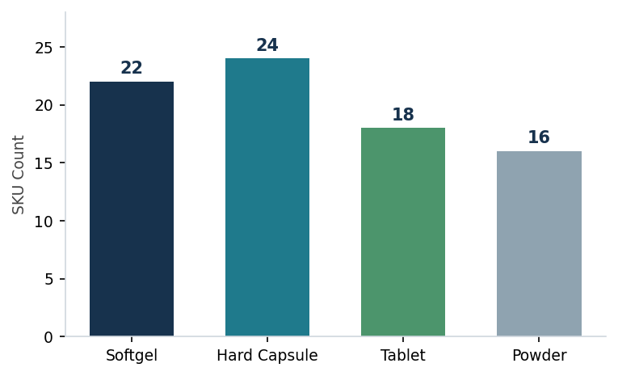
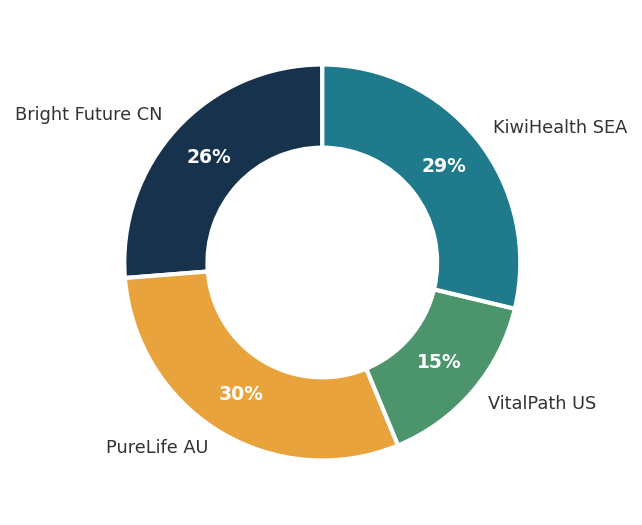
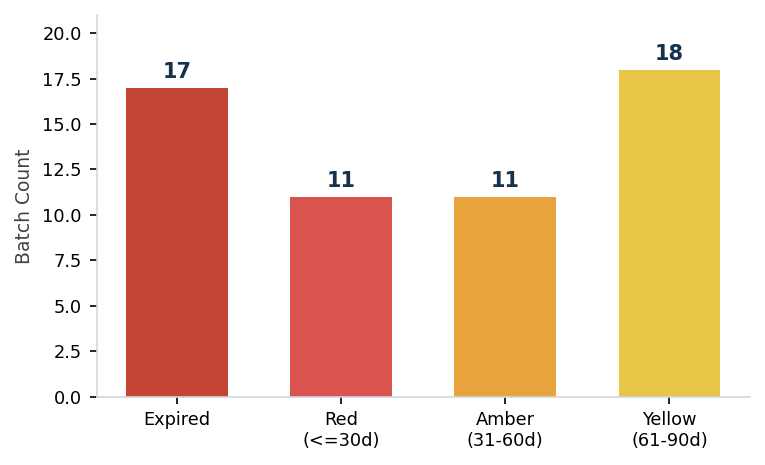

# Pharmaceutical Inventory Health Monitor

An end-to-end inventory health monitor for a pharmaceutical / nutraceutical manufacturing context, covering the full material flow from raw material lots, through work-in-process (WIP), to finished goods.

> **Self-directed case study · Simulated dataset.** This project was built for skills demonstration. It does not use any real company's data and does not represent actual professional or client work.

---

## Overview

Pharmaceutical inventory cannot be treated as a single flat stock list. Material moves through three distinct states, each tracked at batch / lot level with its own expiry clock. This project consolidates scattered batch records into a single view of **value at risk, expiry exposure, and batch traceability**, and turns raw dates into an actionable risk queue.

The work was done in Excel (dynamic arrays) with data validation and charting in Python, following an EDA-first discipline: the dataset was profiled for structure, completeness and business invariants before any calculation, and all key figures were re-validated against the source.

---

## Key Findings

| Metric | Value |
|---|---|
| Total inventory value | NZD 15.0M |
| Already expired (write-off) | NZD 200K |
| Expiring within 60 days | NZD 524K |
| Flagged batches across four alert tiers | 57 |

- **17 batches have already expired**, tying up capital and creating GMP recall-audit obligations.
- A further **NZD 524K expires within 60 days**, giving a clear action window for prioritised clearance.
- **Full batch traceability** is achievable from any finished batch back to its WIP batch and originating supplier raw lot.

---

## Scope

| Tier | Count |
|---|---|
| SKUs | 80 |
| Raw material lots | 58 |
| WIP batches | 30 |
| Finished goods batches | 120 |

---

## What This Demonstrates

- **Three-tier inventory modelling** — raw lot → WIP → finished goods, each with independent expiry tracking
- **EDA-first data discipline** — profile and validate before calculating; structural blanks preserved as facts rather than zero-filled
- **Expiry risk quantification** — a three-tier colour-coded alert system converting dates into a prioritised risk queue
- **Batch traceability** — reconstructing the production chain from finished goods back to supplier lot, aligned to GMP / Medsafe recall-traceability requirements
- **Bilingual reporting** — analysis communicated for both English and Mandarin-speaking readers

---

## Dashboard Preview

**Inventory by dosage form**



**Inventory by export customer**



**Expiry alert tiers** (17 batches already expired)



---

## Batch Traceability Example

Given any finished batch number, the model reconstructs the full production chain back to the supplier lot:

```
Finished Goods   FG-SG-260522-031   Vitamin D3 5000IU Softgel   Qty 2,997   2026-05-22
      ↑ from WIP batch
WIP              WIP-2605-002       Stage: QA testing           Qty 13,030  2026-05-10
      ↑ from raw lot
Raw Material     LOT-P009-2604-041  DSM Nutritional / Vit D3    Qty 300     2026-04-24
```

This is the backbone of GMP / Medsafe recall readiness: if any finished batch is flagged, its complete material history can be traced in seconds.

---

## Full Report

The complete six-page analysis report (background, method, findings, recommendations) is available here:

**[report/Pharmaceutical_Inventory_Health_Monitor.pdf](report/Pharmaceutical_Inventory_Health_Monitor.pdf)**

---

## Repository Structure

```
.
├── README.md
├── report/
│   └── Pharmaceutical_Inventory_Health_Monitor.pdf   # full 6-page report
├── images/
│   ├── dosage_distribution.png
│   ├── customer_distribution.png
│   └── expiry_alert_tiers.png
└── data/
    └── inventory_dataset_simulated.xlsx              # simulated source dataset
```

---

## Tools

Excel (dynamic arrays: LET / FILTER) · Python (pandas, matplotlib) for data validation and charting

---

## Disclaimer

This is an independent, self-directed case study built on a **simulated dataset** created for skills demonstration. It does not use any real company's data and does not represent actual professional or client work. Company and customer names in the dataset are fictional.
